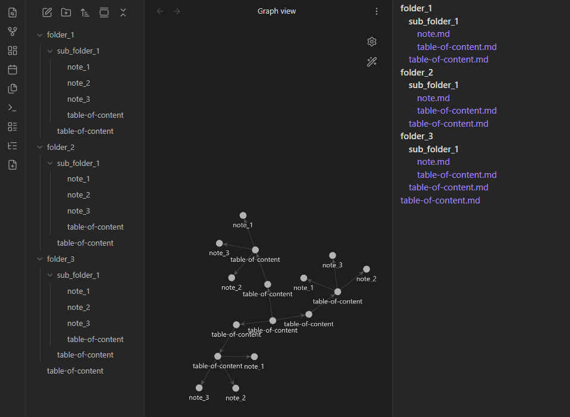

# 🌲 Vault Tree — Obsidian Plugin

**Vault Tree** gives you a structural overview of your entire vault and can generate a recursive set of `table-of-content.md` files for every folder.

It turns your folder structure into a navigable knowledge index.

## 

## ✨ Features

### 🌳 Vault Tree View

- Side panel that shows the **entire vault as a tree**
- Click any file to open it
- Folders are shown before files
- Updates live when files/folders change

### 📄 Recursive Table of Contents Generator

- Creates a `table-of-content.md` inside **every folder**
- Each TOC lists:
  - All notes in that folder
  - Links to the TOCs of all child folders

- Forms a **self-linking structural map** of your vault

---

## 🧠 Why this is useful

Large vaults become hard to navigate by folders alone.

Vault Tree lets you:

- See the whole structure at once
- Navigate via generated TOCs
- Use graph view on TOCs to visualize structure
- Publish or share a vault with clear hierarchy
- Treat folders as knowledge nodes, not just storage

---

## 🖱 Usage

After enabling the plugin, you get two ribbon icons:

| Icon    | Action                                              |
| ------- | --------------------------------------------------- |
| 🌳 Tree | Open the Vault Tree panel                           |
| ➕ File | Generate `table-of-content.md` files in all folders |

Run the TOC generator once, and your vault becomes self-indexing.

---

## 📦 Installation (development)

Clone this repo into your vault:

```
<your-vault>/.obsidian/plugins/vault-tree
```

Then:

```bash
npm install
npm run build
```

Enable **Vault Tree** in Obsidian → Community Plugins.

---

## 🛠 Development

Run TypeScript in watch mode:

```bash
npm run dev
```

After changes, reload plugins inside Obsidian.

---

## 📁 Generated TOC Structure Example

If your vault looks like:

```
Projects/
  Alpha.md
  Beta.md
  Research/
    Paper.md
```

Vault Tree creates:

**Projects/table-of-content.md**

```md
# Projects

## Files

- [[Alpha]]
- [[Beta]]

## Subfolders

- [[Projects/Research/table-of-content]]
```

**Projects/Research/table-of-content.md**

```md
# Research

## Files

- [[Paper]]
```

---

## 🚀 Roadmap

- Collapsible folders in the tree
- Highlight current file
- Icons matching Obsidian File Explorer
- Auto-regenerate TOCs on change
- Sorting options

---

## 🧩 License

This plugin is licensed under **CC BY-NC-SA 4.0**.
You are free to use and modify it, but you may not sell it or use it commercially.
Attribution to the original author is required.

---

## 🙌 Contributing

Issues and PRs welcome.
